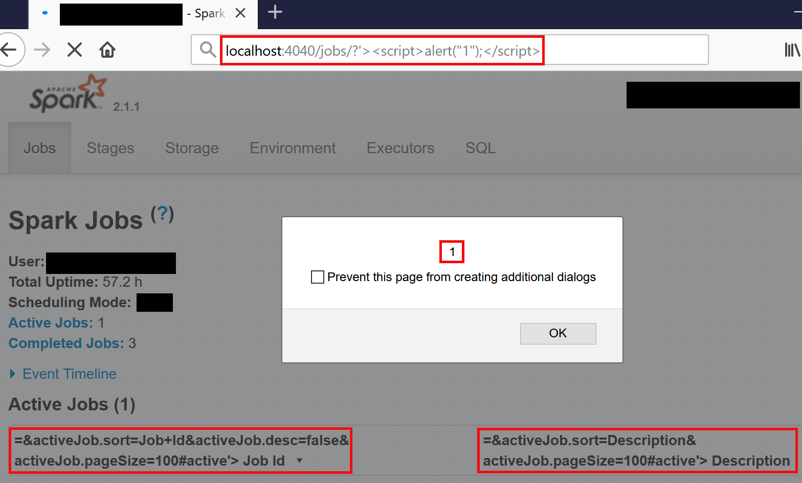

# CVE-2018-8024: Apache Spark XSS vulnerability in UI

## Information
**Description:** In Apache Spark 2.1.0 to 2.1.2, 2.2.0 to 2.2.1, and 2.3.0, it’s possible for a malicious user to construct a URL pointing to a Spark cluster’s UI’s job and stage info pages, and if a user can be tricked into accessing the URL, can be used to cause script to execute and expose information from the user’s view of the Spark UI.  
**Versions Affected:** Apache Spark versions 2.1.0-2.1.2, 2.2.0-2.2.1, 2.3.0  
**Researcher:** Spencer Gietzen (https://github.com/SpenGietz)  
**Disclosure Link:** https://spark.apache.org/security.html#CVE-2018-8024  
**NIST CVE Link:** https://nvd.nist.gov/vuln/detail/CVE-2018-8024  

## Proof-of-Concept Exploit
The vulnerability stems from the confusion of both single and double quotes in the query string of the URL. If only a single quote is included in the payload, it will not be rendered as HTML and the same goes for only a double quote. If you supply a single quote AND a double quote, the single quote is converted to a valid HTML double quote, which terminates the "href" attribute of an "a" tag, which then allows us to insert our arbitrary JavaScript.  
Here are two working examples:
- http://localhost:4040/jobs/?'>
- http://localhost:4040/jobs/?"'>

Screenshot:
